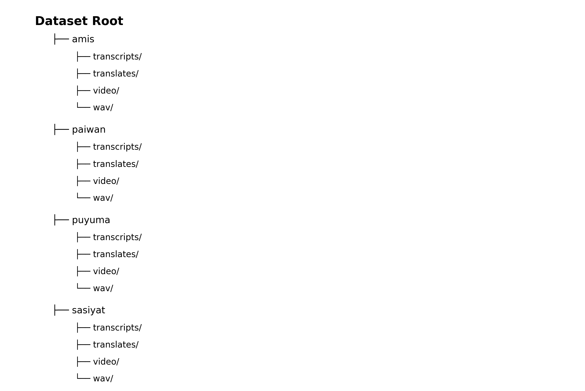

# Multilingual Multimodal Intelligent Application Dataset

This website presents a **multilingual multimodal dataset** designed to support
**intelligent applications**, including speech recognition, speech translation,
and multimodal understanding.

The dataset integrates **video, audio, and multilingual text** with precise
time alignment, providing a solid foundation for data-driven research and
model development.

## Key Features

- Multilingual speech and text data
- Audio–video–text temporal alignment
- Application-oriented dataset design
- Suitable for speech and multimodal AI research

