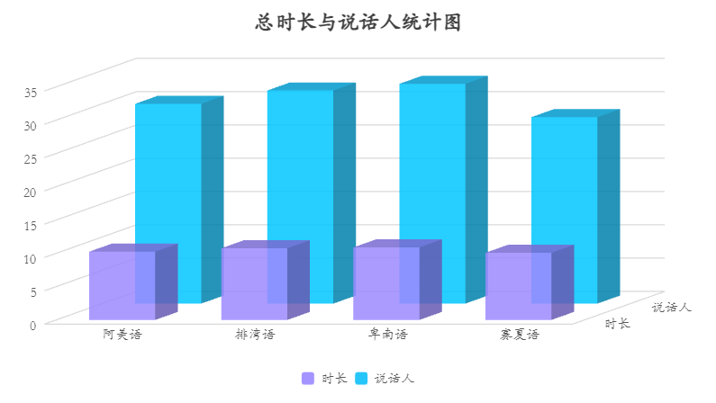
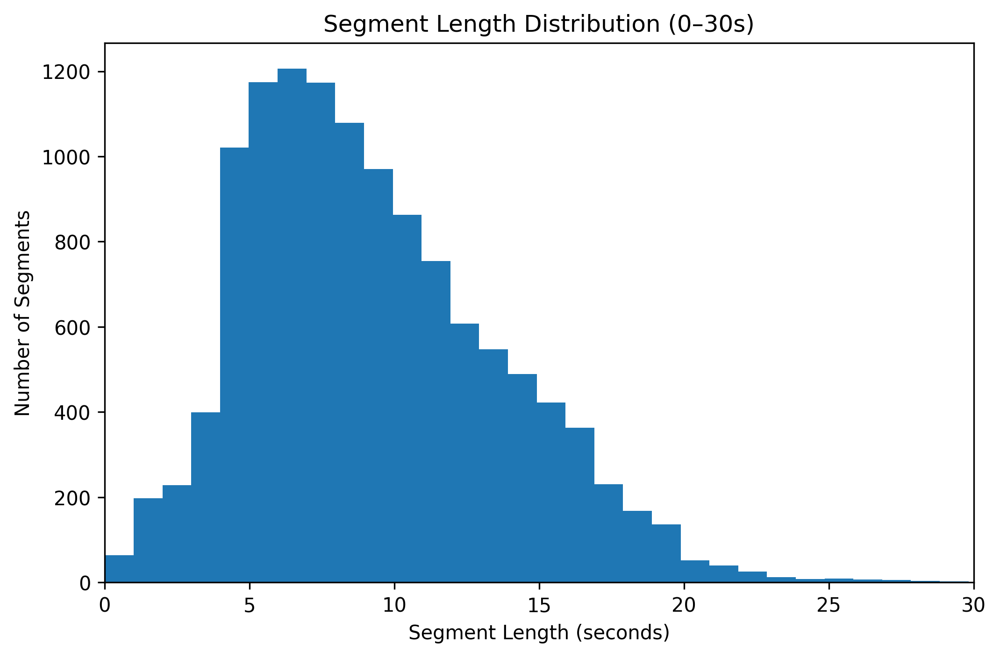

# Data Statistics

This section provides statistical visualizations to help understand the dataset
distribution and identify potential biases.

## Language Distribution

## Segment Length Distribution

## Summary

- Balanced multilingual distribution
- Segment durations suitable for speech models
- Consistent multimodal alignment across samples
